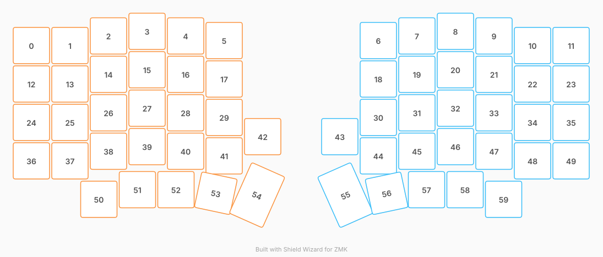

# ZMK Configuration for Sofle gren

*Generated by Shield Wizard for ZMK*



Download compiled firmware from the Actions tab. <https://zmk.dev/docs/user-setup#installing-the-firmware>

Edit your keymap <https://zmk.dev/docs/keymaps>.
User keymap is located at [`config/sofle_green.keymap`](config/sofle_green.keymap).

-----

<details>
<summary>
Shield Wizard Debug Information
</summary>

In case of broken configuration, here is the Shield Wizard internal data used to generate this configuration:

Commit: 91406f4c7cfc67b0f2b2639a4d61044ae69c7e60

```json
{"name":"Sofle gren","shield":"sofle_green","dongle":false,"modules":[],"layout":[{"id":"01KYYN1ZH6GMFDPGCGFRQ1WCTY","part":0,"row":0,"col":0,"w":1,"h":1,"x":0,"y":0.37,"r":0,"rx":0,"ry":0},{"id":"01KYYN1ZH6HMA3RB9V0RKNW7KB","part":0,"row":0,"col":1,"w":1,"h":1,"x":1,"y":0.37,"r":0,"rx":0,"ry":0},{"id":"01KYYN1ZH61WPZ3V85KM5SRFN9","part":0,"row":0,"col":2,"w":1,"h":1,"x":2,"y":0.12,"r":0,"rx":0,"ry":0},{"id":"01KYYN1ZH61TTYRRX2ZSCYPMYB","part":0,"row":0,"col":3,"w":1,"h":1,"x":3,"y":0,"r":0,"rx":0,"ry":0},{"id":"01KYYN1ZH67HF8W1NSP2KHQD4K","part":0,"row":0,"col":4,"w":1,"h":1,"x":4,"y":0.12,"r":0,"rx":0,"ry":0},{"id":"01KYYN1ZH61PPG1XR7VDX0QGKY","part":0,"row":0,"col":5,"w":1,"h":1,"x":5,"y":0.24,"r":0,"rx":0,"ry":0},{"id":"01KYYN1ZH6FTMN52E5DN27XPS2","part":1,"row":0,"col":8,"w":1,"h":1,"x":9,"y":0.24,"r":0,"rx":0,"ry":0},{"id":"01KYYN1ZH6QT6C12BJCQTN143G","part":1,"row":0,"col":9,"w":1,"h":1,"x":10,"y":0.12,"r":0,"rx":0,"ry":0},{"id":"01KYYN1ZH6S8XJ5RKHXC8XVFF2","part":1,"row":0,"col":10,"w":1,"h":1,"x":11,"y":0,"r":0,"rx":0,"ry":0},{"id":"01KYYN1ZH6BS01GGT2WMS5NG1R","part":1,"row":0,"col":11,"w":1,"h":1,"x":12,"y":0.12,"r":0,"rx":0,"ry":0},{"id":"01KYYN1ZH6PPP794FZXT4RM60X","part":1,"row":0,"col":12,"w":1,"h":1,"x":13,"y":0.37,"r":0,"rx":0,"ry":0},{"id":"01KYYN1ZH6C51YBC6TZW9QCG42","part":1,"row":0,"col":13,"w":1,"h":1,"x":14,"y":0.37,"r":0,"rx":0,"ry":0},{"id":"01KYYN1ZH6CDC51K91XP4NAMTB","part":0,"row":1,"col":0,"w":1,"h":1,"x":0,"y":1.37,"r":0,"rx":0,"ry":0},{"id":"01KYYN1ZH6GP7T81MHBX2QJ22Z","part":0,"row":1,"col":1,"w":1,"h":1,"x":1,"y":1.37,"r":0,"rx":0,"ry":0},{"id":"01KYYN1ZH65YKJSSQPQBJYRZKM","part":0,"row":1,"col":2,"w":1,"h":1,"x":2,"y":1.12,"r":0,"rx":0,"ry":0},{"id":"01KYYN1ZH60VAJTNFJR5Q391MH","part":0,"row":1,"col":3,"w":1,"h":1,"x":3,"y":1,"r":0,"rx":0,"ry":0},{"id":"01KYYN1ZH658ABG2B6ZHW0DWV8","part":0,"row":1,"col":4,"w":1,"h":1,"x":4,"y":1.12,"r":0,"rx":0,"ry":0},{"id":"01KYYN1ZH6G7QZ8PS57Y6NYXRT","part":0,"row":1,"col":5,"w":1,"h":1,"x":5,"y":1.24,"r":0,"rx":0,"ry":0},{"id":"01KYYN1ZH61PV4NEC63XJQ1C7Z","part":1,"row":1,"col":8,"w":1,"h":1,"x":9,"y":1.24,"r":0,"rx":0,"ry":0},{"id":"01KYYN1ZH67410NVH6YC1K2JB7","part":1,"row":1,"col":9,"w":1,"h":1,"x":10,"y":1.12,"r":0,"rx":0,"ry":0},{"id":"01KYYN1ZH6CTPCKAR57PJB3SKT","part":1,"row":1,"col":10,"w":1,"h":1,"x":11,"y":1,"r":0,"rx":0,"ry":0},{"id":"01KYYN1ZH7E7HA2FZHRS7E2MJX","part":1,"row":1,"col":11,"w":1,"h":1,"x":12,"y":1.12,"r":0,"rx":0,"ry":0},{"id":"01KYYN1ZH7DGX8P6FB6MJ0D11P","part":1,"row":1,"col":12,"w":1,"h":1,"x":13,"y":1.37,"r":0,"rx":0,"ry":0},{"id":"01KYYN1ZH7SZWB724QA881364G","part":1,"row":1,"col":13,"w":1,"h":1,"x":14,"y":1.37,"r":0,"rx":0,"ry":0},{"id":"01KYYN1ZH7XT6VR44XVS2BMSWK","part":0,"row":2,"col":0,"w":1,"h":1,"x":0,"y":2.37,"r":0,"rx":0,"ry":0},{"id":"01KYYN1ZH7XZNX8V6MCQZFXD05","part":0,"row":2,"col":1,"w":1,"h":1,"x":1,"y":2.37,"r":0,"rx":0,"ry":0},{"id":"01KYYN1ZH7RJFKVFHYRR7DS7AZ","part":0,"row":2,"col":2,"w":1,"h":1,"x":2,"y":2.12,"r":0,"rx":0,"ry":0},{"id":"01KYYN1ZH7R9NAHM0CVJ8RZ489","part":0,"row":2,"col":3,"w":1,"h":1,"x":3,"y":2,"r":0,"rx":0,"ry":0},{"id":"01KYYN1ZH7YZX9362AVRDBXHCJ","part":0,"row":2,"col":4,"w":1,"h":1,"x":4,"y":2.12,"r":0,"rx":0,"ry":0},{"id":"01KYYN1ZH7SR4PRQSWA8RQ4SGK","part":0,"row":2,"col":5,"w":1,"h":1,"x":5,"y":2.24,"r":0,"rx":0,"ry":0},{"id":"01KYYN1ZH7PNYJE2WTKC948CFV","part":1,"row":2,"col":8,"w":1,"h":1,"x":9,"y":2.24,"r":0,"rx":0,"ry":0},{"id":"01KYYN1ZH766YWN54P7JNJTDDS","part":1,"row":2,"col":9,"w":1,"h":1,"x":10,"y":2.12,"r":0,"rx":0,"ry":0},{"id":"01KYYN1ZH7KM664JFB36APYM75","part":1,"row":2,"col":10,"w":1,"h":1,"x":11,"y":2,"r":0,"rx":0,"ry":0},{"id":"01KYYN1ZH76Z7RDD6DF6R6M0AM","part":1,"row":2,"col":11,"w":1,"h":1,"x":12,"y":2.12,"r":0,"rx":0,"ry":0},{"id":"01KYYN1ZH7321S7E2HEGGTTEP9","part":1,"row":2,"col":12,"w":1,"h":1,"x":13,"y":2.37,"r":0,"rx":0,"ry":0},{"id":"01KYYN1ZH7E5TD5K5MBW8F263B","part":1,"row":2,"col":13,"w":1,"h":1,"x":14,"y":2.37,"r":0,"rx":0,"ry":0},{"id":"01KYYN1ZH736VT00E53M74FK7T","part":0,"row":3,"col":0,"w":1,"h":1,"x":0,"y":3.37,"r":0,"rx":0,"ry":0},{"id":"01KYYN1ZH7094130K0KK0X048Q","part":0,"row":3,"col":1,"w":1,"h":1,"x":1,"y":3.37,"r":0,"rx":0,"ry":0},{"id":"01KYYN1ZH72VS5N47Z4GAX4341","part":0,"row":3,"col":2,"w":1,"h":1,"x":2,"y":3.12,"r":0,"rx":0,"ry":0},{"id":"01KYYN1ZH71NJ1TYJD4S47H8ZE","part":0,"row":3,"col":3,"w":1,"h":1,"x":3,"y":3,"r":0,"rx":0,"ry":0},{"id":"01KYYN1ZH7WWE6FHVABG27KCBQ","part":0,"row":3,"col":4,"w":1,"h":1,"x":4,"y":3.12,"r":0,"rx":0,"ry":0},{"id":"01KYYN1ZH74J6E2FSMTR0QZ2H8","part":0,"row":3,"col":5,"w":1,"h":1,"x":5,"y":3.24,"r":0,"rx":0,"ry":0},{"id":"01KYYN1ZH7AV8D8EQR2PSJZRR4","part":0,"row":3,"col":6,"w":1,"h":1,"x":6,"y":2.74,"r":0,"rx":0,"ry":0},{"id":"01KYYN1ZH76A3CZCS1AS06Z4NY","part":1,"row":3,"col":7,"w":1,"h":1,"x":8,"y":2.74,"r":0,"rx":0,"ry":0},{"id":"01KYYN1ZH755566DDZRCQ50FJV","part":1,"row":3,"col":8,"w":1,"h":1,"x":9,"y":3.24,"r":0,"rx":0,"ry":0},{"id":"01KYYN1ZH8TT519CJBCM7FSNT4","part":1,"row":3,"col":9,"w":1,"h":1,"x":10,"y":3.12,"r":0,"rx":0,"ry":0},{"id":"01KYYN1ZH8HRYS9JDGMM06138A","part":1,"row":3,"col":10,"w":1,"h":1,"x":11,"y":3,"r":0,"rx":0,"ry":0},{"id":"01KYYN1ZH8KY1J7102RZWA68G8","part":1,"row":3,"col":11,"w":1,"h":1,"x":12,"y":3.12,"r":0,"rx":0,"ry":0},{"id":"01KYYN1ZH8S8KHMH8Z87ZTSMHH","part":1,"row":3,"col":12,"w":1,"h":1,"x":13,"y":3.37,"r":0,"rx":0,"ry":0},{"id":"01KYYN1ZH88EBN30R6G2E0F3EM","part":1,"row":3,"col":13,"w":1,"h":1,"x":14,"y":3.37,"r":0,"rx":0,"ry":0},{"id":"01KYYN1ZH84JY84DYCVY61ECDF","part":0,"row":4,"col":2,"w":1,"h":1,"x":1.75,"y":4.37,"r":0,"rx":0,"ry":0},{"id":"01KYYN1ZH82FG9BX8KN2YFVAYM","part":0,"row":4,"col":3,"w":1,"h":1,"x":2.75,"y":4.12,"r":0,"rx":0,"ry":0},{"id":"01KYYN1ZH8RRKYHBKW06Q00VTC","part":0,"row":4,"col":4,"w":1,"h":1,"x":3.75,"y":4.12,"r":0,"rx":0,"ry":0},{"id":"01KYYN1ZH8MNDQW35ESDVYNYN2","part":0,"row":4,"col":5,"w":1,"h":1,"x":4.9,"y":4.12,"r":12,"rx":4.9,"ry":4.12},{"id":"01KYYN1ZH8B7NR42JXKHD5E6AW","part":0,"row":4,"col":6,"w":1,"h":1.5,"x":6,"y":3.83,"r":24,"rx":6,"ry":4.33},{"id":"01KYYN1ZH8XS8H8WQE0DCC0FP3","part":1,"row":4,"col":7,"w":1,"h":1.5,"x":8,"y":3.83,"r":-24,"rx":9,"ry":4.33},{"id":"01KYYN1ZH8F2MNDKWEZBG7A26M","part":1,"row":4,"col":8,"w":1,"h":1,"x":9.1,"y":4.12,"r":-12,"rx":10.1,"ry":4.12},{"id":"01KYYN1ZH82BR2SAXSJBP4JDBZ","part":1,"row":4,"col":9,"w":1,"h":1,"x":10.25,"y":4.12,"r":0,"rx":0,"ry":0},{"id":"01KYYN1ZH8RDEH3H4GWBDCZVKQ","part":1,"row":4,"col":10,"w":1,"h":1,"x":11.25,"y":4.12,"r":0,"rx":0,"ry":0},{"id":"01KYYN1ZH861ZMMV7J8S1PYZ0S","part":1,"row":4,"col":11,"w":1,"h":1,"x":12.25,"y":4.37,"r":0,"rx":0,"ry":0}],"parts":[{"name":"left","controller":"nice_nano_v2","pins":{"d5":{"usage":"kscan","kscan":"01KYYNCAJ0GEAZZQZFKT6EJJF3","role":"output"},"d6":{"usage":"kscan","kscan":"01KYYNCAJ0GEAZZQZFKT6EJJF3","role":"output"},"d7":{"usage":"kscan","kscan":"01KYYNCAJ0GEAZZQZFKT6EJJF3","role":"output"},"d8":{"usage":"kscan","kscan":"01KYYNCAJ0GEAZZQZFKT6EJJF3","role":"output"},"d9":{"usage":"kscan","kscan":"01KYYNCAJ0GEAZZQZFKT6EJJF3","role":"output"},"d19":{"usage":"kscan","kscan":"01KYYNCAJ0GEAZZQZFKT6EJJF3","role":"input"},"d18":{"usage":"kscan","kscan":"01KYYNCAJ0GEAZZQZFKT6EJJF3","role":"input"},"d10":{"usage":"kscan","kscan":"01KYYNCAJ0GEAZZQZFKT6EJJF3","role":"input"},"d16":{"usage":"kscan","kscan":"01KYYNCAJ0GEAZZQZFKT6EJJF3","role":"input"},"d14":{"usage":"kscan","kscan":"01KYYNCAJ0GEAZZQZFKT6EJJF3","role":"input"},"d15":{"usage":"kscan","kscan":"01KYYNCAJ0GEAZZQZFKT6EJJF3","role":"input"},"d20":{"usage":"encoder","encoderId":"01KYYPRYVA0W2DZ7JS55W0NM9E","role":"pinB"},"d21":{"usage":"encoder","encoderId":"01KYYPRYVA0W2DZ7JS55W0NM9E","role":"pinA"}},"kscans":[{"kind":"matrix","id":"01KYYNCAJ0GEAZZQZFKT6EJJF3","diodes":true}],"keys":{"01KYYN1ZH6GMFDPGCGFRQ1WCTY":{"input":"d10","output":"d5"},"01KYYN1ZH6CDC51K91XP4NAMTB":{"input":"d10","output":"d6"},"01KYYN1ZH7XT6VR44XVS2BMSWK":{"input":"d10","output":"d7"},"01KYYN1ZH736VT00E53M74FK7T":{"input":"d10","output":"d8"},"01KYYN1ZH6HMA3RB9V0RKNW7KB":{"input":"d16","output":"d5"},"01KYYN1ZH6GP7T81MHBX2QJ22Z":{"input":"d16","output":"d6"},"01KYYN1ZH7XZNX8V6MCQZFXD05":{"input":"d16","output":"d7"},"01KYYN1ZH7094130K0KK0X048Q":{"input":"d16","output":"d8"},"01KYYN1ZH61WPZ3V85KM5SRFN9":{"input":"d14","output":"d5"},"01KYYN1ZH65YKJSSQPQBJYRZKM":{"input":"d14","output":"d6"},"01KYYN1ZH7RJFKVFHYRR7DS7AZ":{"input":"d14","output":"d7"},"01KYYN1ZH72VS5N47Z4GAX4341":{"input":"d14","output":"d8"},"01KYYN1ZH82FG9BX8KN2YFVAYM":{"input":"d14","output":"d9"},"01KYYN1ZH84JY84DYCVY61ECDF":{"input":"d16","output":"d9"},"01KYYN1ZH61TTYRRX2ZSCYPMYB":{"input":"d15","output":"d5"},"01KYYN1ZH60VAJTNFJR5Q391MH":{"input":"d15","output":"d6"},"01KYYN1ZH7R9NAHM0CVJ8RZ489":{"input":"d15","output":"d7"},"01KYYN1ZH71NJ1TYJD4S47H8ZE":{"input":"d15","output":"d8"},"01KYYN1ZH8RRKYHBKW06Q00VTC":{"input":"d15","output":"d9"},"01KYYN1ZH67HF8W1NSP2KHQD4K":{"input":"d18","output":"d5"},"01KYYN1ZH61PPG1XR7VDX0QGKY":{"input":"d19","output":"d5"},"01KYYN1ZH658ABG2B6ZHW0DWV8":{"input":"d18","output":"d6"},"01KYYN1ZH6G7QZ8PS57Y6NYXRT":{"input":"d19","output":"d6"},"01KYYN1ZH7YZX9362AVRDBXHCJ":{"input":"d18","output":"d7"},"01KYYN1ZH7SR4PRQSWA8RQ4SGK":{"input":"d19","output":"d7"},"01KYYN1ZH7WWE6FHVABG27KCBQ":{"input":"d18","output":"d8"},"01KYYN1ZH74J6E2FSMTR0QZ2H8":{"input":"d19","output":"d8"},"01KYYN1ZH8MNDQW35ESDVYNYN2":{"input":"d18","output":"d9"},"01KYYN1ZH8B7NR42JXKHD5E6AW":{"input":"d19","output":"d9"},"01KYYN1ZH7AV8D8EQR2PSJZRR4":{"input":"d10","output":"d9"}},"encoders":[{"id":"01KYYPRYVA0W2DZ7JS55W0NM9E"}],"buses":{}},{"name":"right","controller":"nice_nano_v2","pins":{"d5":{"usage":"kscan","kscan":"01KYYPGD58MPRCS41447GFAHQ0","role":"output"},"d6":{"usage":"kscan","kscan":"01KYYPGD58MPRCS41447GFAHQ0","role":"output"},"d7":{"usage":"kscan","kscan":"01KYYPGD58MPRCS41447GFAHQ0","role":"output"},"d8":{"usage":"kscan","kscan":"01KYYPGD58MPRCS41447GFAHQ0","role":"output"},"d9":{"usage":"kscan","kscan":"01KYYPGD58MPRCS41447GFAHQ0","role":"output"},"d10":{"usage":"kscan","kscan":"01KYYPGD58MPRCS41447GFAHQ0","role":"input"},"d16":{"usage":"kscan","kscan":"01KYYPGD58MPRCS41447GFAHQ0","role":"input"},"d14":{"usage":"kscan","kscan":"01KYYPGD58MPRCS41447GFAHQ0","role":"input"},"d15":{"usage":"kscan","kscan":"01KYYPGD58MPRCS41447GFAHQ0","role":"input"},"d18":{"usage":"kscan","kscan":"01KYYPGD58MPRCS41447GFAHQ0","role":"input"},"d19":{"usage":"kscan","kscan":"01KYYPGD58MPRCS41447GFAHQ0","role":"input"},"d20":{"usage":"encoder","encoderId":"01KYYPVK8RH1B0P7ETFD6P0C3R","role":"pinB"},"d21":{"usage":"encoder","encoderId":"01KYYPVK8RH1B0P7ETFD6P0C3R","role":"pinA"}},"kscans":[{"kind":"matrix","id":"01KYYPGD58MPRCS41447GFAHQ0","diodes":true}],"keys":{"01KYYN1ZH6FTMN52E5DN27XPS2":{"input":"d19","output":"d5"},"01KYYN1ZH6QT6C12BJCQTN143G":{"input":"d18","output":"d5"},"01KYYN1ZH6S8XJ5RKHXC8XVFF2":{"input":"d15","output":"d5"},"01KYYN1ZH6BS01GGT2WMS5NG1R":{"input":"d14","output":"d5"},"01KYYN1ZH6PPP794FZXT4RM60X":{"input":"d16","output":"d5"},"01KYYN1ZH6C51YBC6TZW9QCG42":{"input":"d10","output":"d5"},"01KYYN1ZH61PV4NEC63XJQ1C7Z":{"input":"d19","output":"d6"},"01KYYN1ZH67410NVH6YC1K2JB7":{"input":"d18","output":"d6"},"01KYYN1ZH6CTPCKAR57PJB3SKT":{"input":"d15","output":"d6"},"01KYYN1ZH7E7HA2FZHRS7E2MJX":{"input":"d14","output":"d6"},"01KYYN1ZH7DGX8P6FB6MJ0D11P":{"input":"d16","output":"d6"},"01KYYN1ZH7SZWB724QA881364G":{"input":"d10","output":"d6"},"01KYYN1ZH76A3CZCS1AS06Z4NY":{"input":"d10","output":"d9"},"01KYYN1ZH7PNYJE2WTKC948CFV":{"input":"d19","output":"d7"},"01KYYN1ZH766YWN54P7JNJTDDS":{"input":"d18","output":"d7"},"01KYYN1ZH7KM664JFB36APYM75":{"input":"d15","output":"d7"},"01KYYN1ZH76Z7RDD6DF6R6M0AM":{"input":"d14","output":"d7"},"01KYYN1ZH7321S7E2HEGGTTEP9":{"input":"d16","output":"d7"},"01KYYN1ZH7E5TD5K5MBW8F263B":{"input":"d10","output":"d7"},"01KYYN1ZH755566DDZRCQ50FJV":{"input":"d19","output":"d8"},"01KYYN1ZH8TT519CJBCM7FSNT4":{"input":"d18","output":"d8"},"01KYYN1ZH8HRYS9JDGMM06138A":{"input":"d15","output":"d8"},"01KYYN1ZH8KY1J7102RZWA68G8":{"input":"d14","output":"d8"},"01KYYN1ZH8S8KHMH8Z87ZTSMHH":{"input":"d16","output":"d8"},"01KYYN1ZH88EBN30R6G2E0F3EM":{"input":"d10","output":"d8"},"01KYYN1ZH8XS8H8WQE0DCC0FP3":{"input":"d19","output":"d9"},"01KYYN1ZH8F2MNDKWEZBG7A26M":{"input":"d18","output":"d9"},"01KYYN1ZH82BR2SAXSJBP4JDBZ":{"input":"d15","output":"d9"},"01KYYN1ZH8RDEH3H4GWBDCZVKQ":{"input":"d14","output":"d9"},"01KYYN1ZH861ZMMV7J8S1PYZ0S":{"input":"d16","output":"d9"}},"encoders":[{"id":"01KYYPVK8RH1B0P7ETFD6P0C3R"}],"buses":{}}]}
```

</details>
